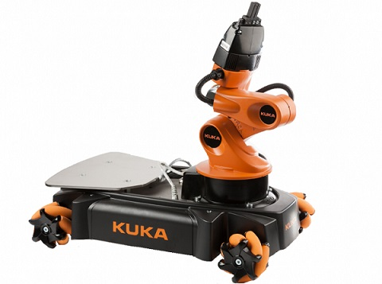

# Mobile-Manipulation

This is the final project of [ME 449 Robotic Manipulation](http://hades.mech.northwestern.edu/index.php/ME_449_Robotic_Manipulation)
that simulates the motion of a KUKA youBot.

The KUKA youBot is a mobile manipulator consisting of a 5R arm mounted
on a omnidirectional mobile mase with four mecanum wheels.

The MATLAB simulator tests the kinematic task-space feedforward plus
feedback control law tracking the end-effector trajectory defined by user.

The functions should run with [Modern Robotics](https://github.com/NxRLab/ModernRobotics)
MATLAB library. And the script can output the CSV file for animation on [V-Rep](http://www.coppeliarobotics.com/).
